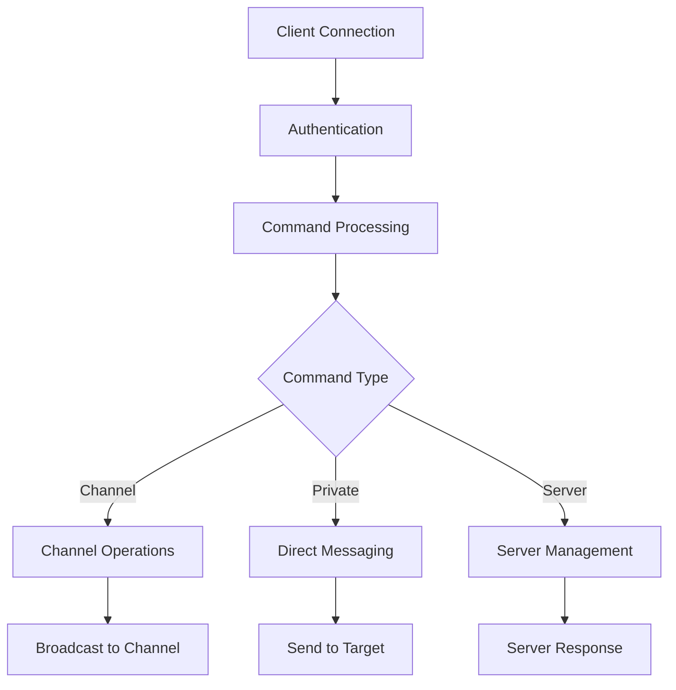

# 🌐 ft_irc - Internet Relay Chat Server

<div align="center">


**A fully functional IRC Server implementation in C++98 following the IRC protocol standards**

[Features](#-features) •
[Installation](#-installation) •
[Usage](#-usage) •
[Commands](#-irc-commands) •
[Bot](#-irc-bot) •
[Architecture](#-architecture)

</div>

---

## 📋 Table of Contents

- [🎯 Project Overview](#-project-overview)
- [✨ Features](#-features)
- [🚀 Installation](#-installation)
- [💻 Usage](#-usage)
- [🎮 IRC Commands](#-irc-commands)
- [🤖 IRC Bot](#-irc-bot)
- [🏗️ Architecture](#-architecture)
- [📁 Project Structure](#-project-structure)
- [🧪 Testing](#-testing)
- [🔧 Troubleshooting](#-troubleshooting)
- [📚 Resources](#-resources)

---

## 🎯 Project Overview

**ft_irc** is a robust IRC (Internet Relay Chat) server implementation built from scratch in C++98. This project creates a multi-client chat server that follows the IRC protocol standards, allowing users to connect with standard IRC clients and enjoy real-time communication through channels and private messages.

### 🎯 Key Objectives
- ✅ Implement a fully functional IRC server
- ✅ Support multiple simultaneous clients
- ✅ Handle channel management with operators
- ✅ Process IRC commands according to RFC standards
- ✅ Maintain stability and performance under load

---

## ✨ Features

### 🔐 Core Server Features
- **Multi-client Support**: Handle unlimited simultaneous connections
- **Non-blocking I/O**: Efficient event-driven architecture using `poll()`
- **Password Authentication**: Secure server access
- **Channel Management**: Create, join, and manage chat channels
- **User Roles**: Regular users and channel operators
- **Private Messaging**: Direct user-to-user communication

### 👥 Channel Management
- **Channel Creation**: Automatic channel creation on first join
- **Operator System**: First user becomes channel operator
- **Channel Modes**:
  - `+i` - Invite-only channel
  - `+t` - Topic restriction to operators
  - `+k` - Channel password protection
  - `+l` - User limit
  - `+o` - Operator privileges

### 🎮 Command Support
| Command | Description | Usage |
|---------|-------------|-------|
| `PASS` | Server authentication | `PASS <password>` |
| `NICK` | Set nickname | `NICK <nickname>` |
| `USER` | Set user information | `USER <username> 0 * :<realname>` |
| `JOIN` | Join channel | `JOIN #<channel> [password]` |
| `PART` | Leave channel | `PART #<channel>` |
| `PRIVMSG` | Send message | `PRIVMSG <target> :<message>` |
| `KICK` | Remove user | `KICK #<channel> <user> [reason]` |
| `INVITE` | Invite user | `INVITE <user> #<channel>` |
| `TOPIC` | Set/view topic | `TOPIC #<channel> [new topic]` |
| `MODE` | Change modes | `MODE #<channel> <+/-><mode> [params]` |
| `NAMES` | List users | `NAMES #<channel>` |

### 🤖 Bonus Features
- **IRC Bot**: Automated bot with jokes and commands
- **File Transfer**: DCC SEND support (bonus)
- **Signal Handling**: Graceful shutdown on SIGINT/SIGTERM

---

## 🚀 Installation

### 📋 Prerequisites
```bash
# Required
- C++ compiler with C++98 support
- Make
- Unix-like system (Linux/macOS)

# Optional (for testing)
- IRC client (irssi, HexChat, WeeChat, etc.)
- netcat (nc) for basic testing
```

### 🔨 Compilation

1. **Clone the repository**
   ```bash
   git clone <repository-url>
   cd ft_irc
   ```

2. **Compile the server**
   ```bash
   make
   ```

3. **Compile the bot (bonus)**
   ```bash
   make bonus
   # or
   cd bot && make
   ```

### 📦 Build Targets
```bash
make          # Build server only
make bonus    # Build server + bot
make clean    # Remove object files
make fclean   # Remove all built files
make re       # Rebuild everything
```

---

## 💻 Usage

### 🖥️ Starting the Server

```bash
./ircserv <port> <password>
```

**Parameters:**
- `port`: Port number (1024-65535)
- `password`: Connection password for clients

**Example:**
```bash
./ircserv 6667 mypassword123
```

### 🤖 Starting the Bot

```bash
./ircbot <port> <password>
```

The bot will automatically connect to `127.0.0.1` and join the `#bot` channel.

### 🔌 Connecting with IRC Clients

#### Using irssi
```bash
irssi
/connect localhost 6667 mypassword123
/nick YourNickname
/join #general
```

#### Using HexChat
1. Add new network: `localhost/6667`
2. Set password: `mypassword123`
3. Connect and join channels

#### Using netcat (basic testing)
```bash
nc localhost 6667
PASS mypassword123
NICK testnick
USER testuser 0 * :Test User
JOIN #test
PRIVMSG #test :Hello World!
```

---

## 🎮 IRC Commands

### 🔐 Authentication Commands

#### PASS - Server Authentication
```irc
PASS <password>
```
Must be sent before NICK and USER commands.

#### NICK - Set Nickname
```irc
NICK <nickname>
```
Sets your nickname. Must be unique on the server.

#### USER - Set User Information
```irc
USER <username> <hostname> <servername> :<realname>
```
Completes the registration process.

### 📺 Channel Commands

#### JOIN - Join Channel
```irc
JOIN #<channel> [password]
```
- Creates channel if it doesn't exist
- First user becomes operator
- Password required if channel has `+k` mode

#### PART - Leave Channel
```irc
PART #<channel>
```
Leaves the specified channel.

#### TOPIC - Channel Topic
```irc
TOPIC #<channel>          # View current topic
TOPIC #<channel> :New topic  # Set new topic (operators only if +t)
```

### 💬 Communication Commands

#### PRIVMSG - Send Message
```irc
PRIVMSG #<channel> :Hello everyone!     # Channel message
PRIVMSG <nickname> :Private message     # Private message
```

### 👑 Operator Commands

#### KICK - Remove User
```irc
KICK #<channel> <nickname> :Reason for kick
```
Removes a user from the channel (operators only).

#### INVITE - Invite User
```irc
INVITE <nickname> #<channel>
```
Invites a user to the channel.

#### MODE - Channel Modes
```irc
MODE #<channel> +i              # Set invite-only
MODE #<channel> -i              # Remove invite-only
MODE #<channel> +t              # Topic restricted to operators
MODE #<channel> +k password     # Set channel password
MODE #<channel> +l 50           # Set user limit to 50
MODE #<channel> +o nickname     # Give operator status
MODE #<channel> -o nickname     # Remove operator status
```

### 📋 Information Commands

#### NAMES - List Channel Users
```irc
NAMES #<channel>
```
Shows all users in the channel. Operators are prefixed with `@`.

---

## 🤖 IRC Bot

The IRC bot is an automated client that connects to your server and provides interactive commands.

### 🎯 Bot Features
- **Automatic Connection**: Connects to server on startup
- **Command Processing**: Responds to `!` prefixed commands
- **Joke Database**: Built-in programming jokes
- **Channel Management**: Automatically joins `#bot` channel

### 🎮 Bot Commands

| Command | Description | Example |
|---------|-------------|---------|
| `!help` | Show available commands | `!help` |
| `!ping` | Responds with "Pong!" | `!ping` |
| `!pong` | Responds with "Ping!" | `!pong` |
| `!hi` | Greets the user | `!hi` |
| `!joke` | Tells a random programming joke | `!joke` |

### 💬 Example Bot Interaction
```irc
<YourNick> !hi
<ircbot> Hello YourNick! How are you doing?

<YourNick> !joke  
<ircbot> Why don't programmers like nature? It has too many bugs!

<YourNick> !help
<ircbot> Available commands: !help, !ping, !pong, !hi, !joke
```

### 🔧 Bot Configuration
The bot connects to `127.0.0.1` by default. To modify:
1. Edit `bot/src/main.cpp`
2. Change the server address in the Bot constructor
3. Recompile with `make bonus`

---

## 🏗️ Architecture

### 🧱 Core Components

#### Server Class
- **Purpose**: Main server management and client handling
- **Key Features**:
  - Socket creation and binding
  - Client connection acceptance
  - Command parsing and routing
  - Signal handling for graceful shutdown

#### Client Class
- **Purpose**: Individual client connection management
- **Key Features**:
  - Connection state tracking
  - Authentication status
  - Input/output buffering
  - User information storage

#### Channel Class
- **Purpose**: Chat channel management
- **Key Features**:
  - Member list management
  - Operator privileges
  - Channel modes and settings
  - Topic management

### 🔄 Data Flow



### 🌐 Network Architecture

1. **Server Socket**: Listens for incoming connections
2. **Poll Loop**: Monitors all file descriptors for activity
3. **Event Processing**: Handles read/write events
4. **Command Router**: Dispatches commands to handlers
5. **Response System**: Sends replies back to clients

---

## 📁 Project Structure

```
ft_irc/
├── 📄 Makefile                    # Build configuration
├── 📄 README.md                   # This file
├── 📁 include/                    # Header files
│   ├── 📄 Server.hpp              # Server class definition
│   ├── 📄 Client.hpp              # Client class definition
│   ├── 📄 Channel.hpp             # Channel class definition
│   └── 📄 Bot.hpp                 # Bot class definition
├── 📁 src/                        # Source files
│   ├── 📄 main.cpp                # Server entry point
│   ├── 📄 Server.cpp              # Server implementation
│   ├── 📁 classes/                # Class implementations
│   │   ├── 📄 Client.cpp          # Client implementation
│   │   └── 📄 Channel.cpp         # Channel implementation
│   ├── 📁 commands/               # IRC command handlers
│   │   ├── 📄 CommandParser.cpp   # Command parsing
│   │   ├── 📁 authentication/     # Auth commands
│   │   │   ├── 📄 Pass.cpp        # PASS command
│   │   │   ├── 📄 Nick.cpp        # NICK command
│   │   │   ├── 📄 User.cpp        # USER command
│   │   │   └── 📄 Quit.cpp        # QUIT command
│   │   ├── 📁 channel/            # Channel commands
│   │   │   ├── 📄 Join.cpp        # JOIN command
│   │   │   ├── 📄 Part.cpp        # PART command
│   │   │   ├── 📄 Topic.cpp       # TOPIC command
│   │   │   ├── 📄 Names.cpp       # NAMES command
│   │   │   ├── 📄 Kick.cpp        # KICK command
│   │   │   ├── 📄 Invite.cpp      # INVITE command
│   │   │   └── 📄 Mode.cpp        # MODE command
│   │   └── 📁 messaging/          # Message commands
│   │       └── 📄 Privmsg.cpp     # PRIVMSG command
└── 📁 bot/                        # IRC Bot (bonus)
    ├── 📄 Makefile                # Bot build config
    ├── 📁 include/                # Bot headers
    │   └── 📄 Bot.hpp             # Bot class definition
    └── 📁 src/                    # Bot source files
        ├── 📄 main.cpp            # Bot entry point
        └── 📄 Bot.cpp             # Bot implementation
```

---

## 🧪 Testing

### 🔍 Basic Functionality Tests

#### 1. Server Startup Test
```bash
./ircserv 6667 testpass
# Should start without errors and listen on port 6667
```

#### 2. Client Connection Test
```bash
# Terminal 1: Start server
./ircserv 6667 testpass

# Terminal 2: Connect with netcat
nc localhost 6667
PASS testpass
NICK testuser
USER testuser 0 * :Test User
# Should receive welcome messages
```

#### 3. Channel Operations Test
```bash
# After connecting:
JOIN #test
PRIVMSG #test :Hello World!
NAMES #test
TOPIC #test :Test Channel Topic
# Test all commands systematically
```

### 🤖 Bot Testing

```bash
# Terminal 1: Start server
./ircserv 6667 testpass

# Terminal 2: Start bot
./ircbot 6667 testpass

# Terminal 3: Connect as user and test bot
nc localhost 6667
PASS testpass
NICK testuser
USER testuser 0 * :Test User
JOIN #bot
PRIVMSG #bot :!help
PRIVMSG #bot :!joke
```

### 🔧 Stress Testing

#### Multiple Clients Test
```bash
# Use this script to test multiple connections
for i in {1..10}; do
    (echo -e "PASS testpass\nNICK user$i\nUSER user$i 0 * :User $i\nJOIN #stress\nPRIVMSG #stress :Hello from user $i\nQUIT" | nc localhost 6667) &
done
```

#### Partial Message Test
```bash
# Test handling of partial messages (as per subject requirements)
nc -C localhost 6667
# Send: com^D (Ctrl+D)
# Send: man^D
# Send: d^D
# Should handle partial command properly
```

---

## 🔧 Troubleshooting

### ❌ Common Issues and Solutions

#### 🔴 "Address already in use" Error
```bash
# Problem: Port is still bound from previous run
# Solution: Wait or kill existing process
lsof -ti:6667 | xargs kill -9
# Or use a different port
./ircserv 6668 testpass
```

#### 🔴 Client Connection Refused
```bash
# Check if server is running
ps aux | grep ircserv

# Check if port is open
netstat -tlnp | grep 6667

# Ensure firewall allows connections
sudo ufw allow 6667
```

#### 🔴 Bot Won't Connect
```bash
# Ensure server is running first
./ircserv 6667 testpass

# Check bot connection
./ircbot 6667 testpass
# Bot should show "Connected to server" message
```

#### 🔴 Permission Denied Errors
```bash
# Ensure you're not trying to bind to privileged ports (<1024) without sudo
# Use ports >= 1024
./ircserv 8080 testpass
```

### 🔍 Debug Mode

Enable debug output by uncommenting debug statements in the source code:
```cpp
// In CommandParser.cpp
std::cout << "Parse Command : " << message << std::endl;
```

### 📊 Memory Leak Detection

```bash
# Compile with debug flags
make CFLAGS="-g -fsanitize=address"

# Run with valgrind
valgrind --leak-check=full ./ircserv 6667 testpass
```

---

## 📚 Resources

### 📖 IRC Protocol References
- [RFC 1459 - Internet Relay Chat Protocol](https://tools.ietf.org/html/rfc1459)
- [RFC 2812 - Internet Relay Chat: Client Protocol](https://tools.ietf.org/html/rfc2812)
- [IRC Numeric Replies](https://www.alien.net.au/irc/irc2numerics.html)

### 🛠️ Development Tools
- [IRC Client Testing](https://hexchat.github.io/) - HexChat IRC Client
- [Command Reference](https://modern.ircdocs.horse/) - Modern IRC Documentation
- [Protocol Testing](https://ircv3.net/support/networks.html) - IRCv3 Test Networks

### 📚 Learning Resources
- [Beej's Guide to Network Programming](https://beej.us/guide/bgnet/)
- [C++ Socket Programming](https://www.geeksforgeeks.org/socket-programming-cc/)
- [Poll() System Call](https://man7.org/linux/man-pages/man2/poll.2.html)

---

<div align="center">

### 🎉 Congratulations on completing ft_irc!

**Made with ❤️ by [Your Name]**

*This project demonstrates advanced C++ programming, network protocols, and system programming concepts.*

[](https://42.fr)

</div>

---

## 📝 Notes

### 🎯 Project Requirements Compliance
- ✅ **C++98 Standard**: All code follows C++98 specifications
- ✅ **No External Libraries**: Only standard C++98 and allowed system calls
- ✅ **Non-blocking I/O**: Uses poll() for efficient event handling
- ✅ **Multi-client Support**: Handles multiple simultaneous connections
- ✅ **IRC Protocol**: Implements required IRC commands and responses
- ✅ **Memory Management**: Proper cleanup and leak prevention
- ✅ **Error Handling**: Robust error checking and graceful failure

### 🏆 Bonus Features Implemented
- ✅ **IRC Bot**: Interactive bot with command system
- ✅ **File Transfer**: Basic DCC SEND support
- ✅ **Signal Handling**: Graceful shutdown capabilities
- ✅ **Extended Commands**: Additional IRC command support

### 🔮 Future Improvements
- Channel history persistence
- SSL/TLS encryption support
- Advanced bot AI capabilities
- Web interface for server management
- Performance monitoring and metrics

---

*Happy Coding! �
